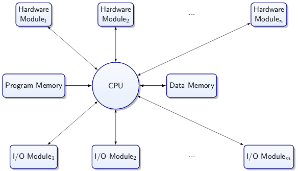
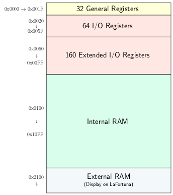

# Memory Mapped I/O

A microprocessor is a combination of a CPU, memory and hardware modules.


However, how is software connected to the hardware?

## Control Registers

They are a set of flip flops that are not only connected for reading and writing. Their inputs or outputs are wired into other circuits. However, how does the CPU interact with the control registers?

There are two ways:

* I/O Instructions
  * An instruction set of the processor has I/O commands
  * I/O commands control I/O port registers
* Memory Mapped I/O
  * I/O registers have addresses in reserved memory space
  * Therefore has memory access

When choosing one of the two methods, you should consider the size of address space, the convenience of access (different addressing modes), the size of the instruction set (as instruction bits are precious) and possible cache complications.

## AT90USB1286

C assumes a single address space (von Neumann). The intended address space is indicated to the linker by a specific big offset.



All hardware modules on microcontroller configured by writing to I/O registers.
All communication to and most from these modules is faciliated by reading/writing I/O registers.

There are three main registers for each set of pins:

* PORT* - Port * Data Register
* DDR* - Port * Data Direction Register
* PIN* - Port * Input Pins Address

We can use the io.h header file to define constant labels for the correct addresses for the registers on the target chip. They are 8-bit unsigned int registers.

For example, to set PB7 as 1 in the DDRB, you do the following:

``` c
DDRB |= _BV(PB7);
```

To set PB7 as 0 in the DDRB, you do:

```c
DDRB &= ~_BV(PB7);
```

