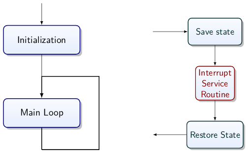
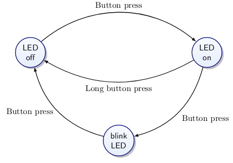

# Interrupt Handling and Event Driven Programming

## I/O Methods

* Programmed I/O (Polling)
  * CPU in tight loop til input available or output accepted
  * Occupies CPU
  * Fast reaction possible
* Interrupt driven I/O
  * Hardware signal changes program flow
  * CPU does other work unless I/O possible

To overcome inefficiency of programmed I/O, interrupt CPU when I/O devices ready to send/receive data.
The state of the interrupted process must be preserved.

### Precise Interrupt

1. State of PC preserved
2. Everything before PC fully executed
3. Nothing beyond PC started
4. Execution state of instruction at PC known

The processor completes its current instruction, acknowledges the interrupt, the hardware saves some state (the program counter and process status word), and then the PC register is loaded with the value from the interrupt vector table.

Software will disable any interrupts, saves some additional states (such as registers, which is saved to the stack), it may then re-enable interrupts, it will then service the interrupt through the interrupt service routine, restore the state, enable interrupts and the restore the PC and PSW.

## Interrupt Service Routine

The procedure executed when interrupts occur and that handle the interrupt.

1. Keep them fast!
   * Avoid loops, heavy instructions (e.g. printf()), and should not block the CPU (e.g. scanf())
   * Life simpler if you make your ISR uninterruptable
     * No worries about stack depth
     * No overhead for re-entrant code
     * Has latency
     * Can lead to lost interrupts
   * Move data that needs processing to some buffer, set global flag, return immediately
   * Check flag in main loop and do work there
2. Keep them simple
   * Debugging ISRs difficult

## Latency

Delay between getting a signal and acting on it.

How long does it take until the CPU can respond (guarantee it will take no longer than a set amount of time), and is this delay deterministic (particularly important in a control algorithms)?

Deterministic latency important in real-time applications. For example, human operations/control algorithms can adapt to deterministic latency, but struggle with random delay.

We can have latency due to hardware (current instruction completion, saving states), as well as latency due to software (saving states, max length of critical sections to disable interrupts).

## Jitter

Varience of the delay.

Instructions cannot be interrupted. They must be allowed to be executed. Some instructions take more than one clock cycle to complete. The response time depends upon the instruction being executed whilst the interrupt arrives.

## Events

Keep an infinite loop and handle ISRs for events as they come in. This concept can be represented by a Moore machine.

### Internal, External Events

* Internal
  * Timer overflow
  * Completion of ADC conversion
* External
  * Analogue comparator exceeds threshold
  * Keyboard input
  * Display refresh cycle

Is there a max arrival rate? Is this is physical limit or down to the scheduler?

Is there a deadline for servicing an event? What is the cost if missed, and what part is time sensitive?

What if the longest time interrupts are disabled? How does this impact on other realtime code?

## Interrupt Vectors

Different interrupt sources have different vectors. Each is associated with an ISR. Needs to be ISR for every interrupt source that is enabled. For processor to know where to branch, there is a table at start of program memory with interrupt vector address of the ISR for each source.

A variable used in the ISR and the main program may need to be declared volatile, to let the compiler know not to cache it in a register. Multi-byte variables need to be accessed atomically outside of the ISR. It turns off optimisation for a variable, making it slow in comparison to other variables. If a volatile variable is used lots in ISR, copy to local variable.

Operations on registers that are used by the ISR and the main program need to be atomic, which means that they complete without an interruption.

For AVR, you should:

1. Register the ISR
2. Enable the interrupt at a device level
3. Globally enable interrupts

### `avrlibc`'s interrupt API

It facilitates the registering of ISRs, including prologue and epilogue
`(reti();)`

Switching on and off of global interrupts allowed.

By default, if an ISR is undefined, reset the chip.