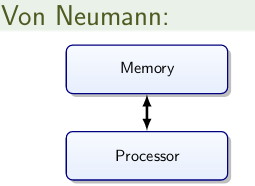
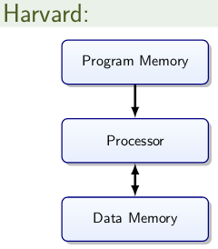
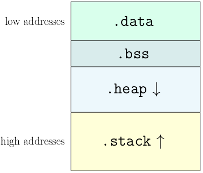

# Memory Architecture

Von Neumann and Harvard architectures:
 

Von Neumann was used in beginning. Von Neumann has a bottleneck of a single bus.
There is no separation of data and program: CPU has to decide what to execute.

Harvard has less bus congestion, but you need to pre-decide how to split up program and data memory.

## AVR Microcontroller Memory

| Bus     | Technology           | Size   | Persistent | Writes |
| ------- | -------------------- | ------ | ---------- | ------ |
| Program | Flash                | 128 KB | Yes        | Slow   |
| Data    | EEPROM               | 4 KB   | Yes        | Slow   |
| Data    | SRAM (w/ flip flops) | 8 KB   | No         | Fast   |

EEPROM: Electrically Erasable Programmable Read Only Memory
SRAM: Static RAM

Slow writes impact performance and need to be considered from a reliability perspective (e.g. power failure)

### SRAM

* Very fast
* Volatile
* Cell level random read/write
* Unlimited read/write

### Flash

* Non-volatile
* Fast cell-level read
* Block writing
* Write requires erasing beforehand
* Limited number of writes

### EEPROM

* Non-volatile
* Cell-level read
* Cell-level write
* Limited number of writes

In program memory (flash), the low addresses will have the interrupt vector table.

### RAM Layout

* .data
  * Initialised global variables
* .bss
  * Unintialised global variables
* .heap
* .stack
  * These two are very important!

## Heap and Stack

RAM is not taken up by global vars and the local static vars are shared dynamically between heap and stack.

* Heap
  * Used to serve explicit runtime memory requests
  * Library functions may use this (such as io.h)
* Stack
  * Required for function calls (stack frame for local variables, return address)
  * Starts at top of RAM, grows down.