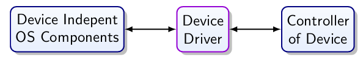

# Device Drivers

Operating Systems:

* Provide a uniform interface
  * For users
  * For programs
  * PC should have
    * Some terminal
    * Keyboard
    * Hard disk/SSD
  * Embedded may have
    * Serial port
    * Memory card
* Manage resources
  * CPU time
  * Memory
  * Access to devices
* Management of interactions
  * Desired: networking, communications amongst users/processes
  * Undesired: protection and security

## Uniform Interface

We need a uniform interface for device class or system:

* PC
  * Terminal
  * Keyboard
  * Hard drive
* Embedded
  * Serial port?
  * Memory card?

In contrast to a PC where minimum of I/O hardware guaranteed, for embedded the hardware config varies. If a type of I/O exists, a standardized form of access can be provided.

## Application Interface

The OS:

* Isolates software from
  * Device details
  * Device tech
  * Communication protocol
* May be stable over decades
* Bridges to the user space
* Provides abstraction of device
  * Character devices
    * CD, Vinyl, Tape, etc
  * Block devices
    * Hard drive, SSD
* Provides:
  * Buffering
    * Area to store data before processing
  * Error handling
  * Allocation
    * Naming
    * Protection

## Role of the Driver

Driver may need to:

* Initialise device
* Manage power supply of device
  * Power up/standby/power down
* Protect device from harmful commands
* Deal with availability

Device drivers need low level access to the I/O registers. It needs privileged access and will run in kernel space. It requires detailed knowledge of the device hardware and is typically made by the device manufacturer.

## Abstraction

You'd want an abstraction to simplify programming and for the code lifetime/reuse, but it may get in the way of optimisation of the device driver. The physical device can differ from the abstract model that is assumed by the OS.

## Potential Drivers for LaFortuna

* Buttons
* Rotary Encoder
* Display Driver
* File System
  * SD card
  * EEPROM
* Audio Output

## How to Write a Driver

Start with the data sheet. What commands are available? Is there any sample code provided? Getting a complex device to react for the first time is challenging. You can also pay attention to reset conditions and required timing.

Low-level hardware develops very quickly. To make high volume hardware, it must be highly adaptable. This makes it more complex to configure. The documentation for this is often very poor and the sample code is generally poor.
Chips can also be substituted for other variants and the chips can have bugs on them.

While unconnected, electronics can be sensitive to electrostatics. Touch a metal case before handling or wrap it in aluminium foil when placing it into storage.

Never reverse the polarity on a power supply line.

If the microcontroller and the module run on different voltages, check whether extra circuitry is required.