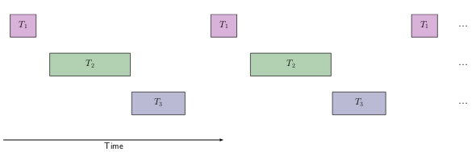

# Real-time Scheduling

Task have deadlines, can be periodic or aperiodic and can have a constant duration.
Real-time scheduling often requires predictable behaviours and therefore needs guarantees.

## CPU Utilisation - U

$U = c_\text{total} - c_\text{idle} \leq 1$

For our analysis, we will make the following assumptions:

1. Tasks are periodic
   * Convert aperiodic tasks via polling
2. The deadline for a task is its next invocation
   * Previous instance of task has to finish before it has to run again
3. Context switches take no time (switching between tasks)
   * Leave some margin in duration and deadline

Given a set of tasks, $T_1 ... T_n$ with periodicity $p_i$ and a fixed CPU time of $c_i$ for $T_i$ (worst-case scenario), the utilisation of the CPU is as follows:
$$
U=\sum_{i=1}^{n}\frac{c_i}{p_i}
$$
A real-time system is schedulable if:
$$
U=\sum_{i=1}^{n}\frac{c_i}{p_i} \leq 1
$$
assuming periodic tasks, with the next invocation as deadline and no overhead for context switching.

## How to Schedule

We need a predictable worst-case performance estimate.

In the simplest case, all tasks finish within the period of the most frequent task. Static cycle scheduling is possible, where we use a table to assign time slots to tasks.

### Priority

We can set two types of priorty:

1. Fixed (static) Priority
   * Assigned at compile time
2. Dynamic Priority
   * Changes during runtime

## Fixed Priority Scheduling

It is simple (the code, and its changes later in development, are easy to verify) and well understood, leading to confidence in its behaviour. The optimal FP scheme is Rate Monotonic Scheduling.

## Rate Monotonic Scheduling

The requirements:

1. Tasks are independent
   * One task cannot block another task
2. Tasks have a fixed CPU requirement
3. Free context switching
4. Deadline is the task period

The most frequent task has the highest priority. Therefore we have guaranteed scheduling for:
$$
U = \sum_{i=1}^{n}\frac{c_i}{p_i}\leq n(2^{\frac{1}{n}}-1)
$$
where $n \rightarrow \infty \implies U \leq ln_2$.

Use RMS, your own priority assignment will not outperform it. To guarantee scheduling for any task set that satisfies conditions, the bound has to assume worst-case task set:

* Your task set may be RMS schedulable
* No guarantee that it is
* Requires analysis of specific task set

If wasting 30% of CPU time, use non-real time tasks as low priority in remaining CPU and optimise task periods to achieve a regular execution pattern.

## Harmonic Task Sets

Every task period is a multiple of the period of any higher priority task. Possible to make the task set harmonic and schedule with RMS. RMS can reach 100% $U$ with harmonic sets. They are easy to analyse, and also worth noting that shorter deadlines may be better.

### Issues of RMS

* What happens in an overload situation?
* Are the assumptions realistic?
* Deadlines can be used instead of periods

## Dynamic Priority Scheduling

We can use Earliest Deadline First. It has a dynamic change of priority, runs the most urgent tasks first, is higher complexity, can have $U$ up to 100% and can be done with and without preemption.
$$
U=\sum_{i=1}^{n}\frac{c_i}{p_i} \leq 1
$$
The scheduler is more complicated, has more overhead, but can handle the changing importance of tasks, can accommodate new tasks at runtime, can handle variable execution, but is not stable under overload. EDF is optimal.